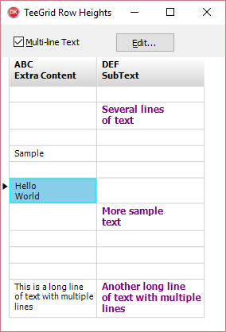

# TeeGrid Release Notes

## Version: Release v1.11, 16th Sept. 2021

### New Features:

- Now supporting RAD Studio 11 Alexandria.

### Modification & bugfix report:

https://tinyurl.com/TeeGrid-Changes-1-11

---

## Version: Release v1.10, 29th May 2020

### New Features:

- Now supporting RAD Studio 10.4 Sydney.

### Modification & bugfix report:

https://tinyurl.com/TeeGrid-Changes-1-10

---

## Version: Release v1.09, 4th Feb 2020

### New Features:

- TeeGrid adds full support for RAD Studio 10.3 Rio (RX/DX/CX) Update 3.

### Modification & bugfix report:

https://tinyurl.com/TeeGrid-BugFixes-1-09

---

## Version: Release v1.08, 9th May 2019

### New Features:

* New ParentFont property for TeeGrid
* New Mouse sensitivity control to avoid high CPU usage on mouseover
* Indicator column header now takes common header brush

### Modification & bugfix report:

https://tinyurl.com/TeeGrid-BugFixes-1-08

---

## Version: Release v1.07, 19th December 2018

### New Features:

* Support Rad Studio 10.3 Rio
* Added new feature Layout Manager. Saves your custom layout and format.

### Modification & bugfix report:

https://tinyurl.com/TeeGrid-BugFixes-1-07

---

## Version: Release v1.06, 18th July 2018

### New Features:

* Added support for JSON export

### Modification & bugfix report:

https://tinyurl.com/TeeGrid-BugFixes-1-06

---

## Version: Release v1.05, 23th March 2018

### New Features:

* TeeGrid now is supported for Rad Studio 10.2 Tokyo update 3

### Modification & bugfix report:

https://tinyurl.com/TeeGrid-BugFixes-1-05

---

## Version: Release v1.04, 16th January 2018

### New Features:

* TeeGrid now is supported for Rad Studio 10.2 Tokyo update 2

---

## Version: Release v1.03, 31st October 2017

### Modification & bugfix report:

<a href="http://bugs.teechart.net/buglist.cgi?bug_status=RESOLVED&bug_status=VERIFIED&chfield=resolution&chfieldfrom=2017-04-06&chfieldto=2017-10-30&chfieldvalue=FIXED&list_id=8265&product=TeeGrid%20for%20Delphi&query_format=advanced&resolution=FIXED">Fixed bug report</a>

* #1784 Problem with Repaint of Grid when Datasource is Detail of MasterDetail data
* #1851 Cells are not selected by clicking on them, two consecutive single clicks are required.
* #1854 Grid doesn't scroll with the keyboard if no cell is selected
* #1808 Unreproducable problems when TEdits are bound to data that TeeGrid is also bound
* #1850 Grid doesn't scroll with the keyboard when connected to a DataSource/DataSet

### Other items:
* TeeGrid now activated as 'ideal' plugin for (<a href="https://www.steema.com/product/teebi">TeeBI</a>)

---

## Version: Release v1.02, 6th April 2017

### Improvements

* Renamed EOF to PastEnd. C++ Builder fails with "EOF" (reserved use)
* Added support for CrossVCL
* Editor form improvements
* new "band" class : TColumnsBand, to allow custom text per-column at, for example, header or footer. Is independent of Tee.Grid.Header.

### Bug fixes

* Alias "TArrayOfStrings" of TStringArray to avoid conflict for Lazarus 1.6.4.
* Fixed TRows.GetHeights, Was AV when Index at -1
* Pre-XE2 namespaces fix (commented Vcl.Buttons to {Vcl.}Buttons )
* Resilience improvement for TTeeGrid.ResetScrollBars
* Fix bug #1784 (http://bugs.teechart.net/show_bug.cgi?id=1784). Problem with Repaint of Grid when Datasource is Detail of MasterDetail data

---

## Version: Release v1.01, 1st Mar 2017
 
### BREAKING Changes

* All units named "Tee.Grid.Data.XXX" have been renamed to "Tee.GridData.XXX" because C++ Builder has a limitation: https://quality.embarcadero.com/browse/RSP-15031
* TeeGrid event "OnCellEdited" has new "ChangeData" and "NewData" parameters
* TRenderData record renamed fields: "Rect" to "Bounds", and "Text" to "Data"
* TRows "Count" function removed (renamed to "Empty" boolean)

### New Examples

* "Custom Sorting" shows how to use column header clicks to sort data
* New simple demo using FireMonkey and FireDAC datasets
* "ClientDataSet" example shows how to hide column contents
(eg: to display "****" text in cells, like password fields)
* New "Static Charts" example, shows how to paint TeeChart charts inside cells
* New "VirtualData\Matrix" demo, shows to to link a grid with a 2D array using both rtti and "virtual mode" ways

### Improvements

* TeeGrid1.Grid.Copy method now can accept an optional selected cell parameter
* TeeGrid1.Painter.BitmapQuality new property (used to paint bitmaps in cells)
* New TVirtualObjectListData alias class, to link TObjectList<T> generic data to grids
* New TColumnBand "Drag" property to customize column mouse drag 
* New TTextRender "Trimming" property (to clip text using "..." elipsi)
* New TPasswordRender (see "ClientDataSet" demo for usage example)
* Two new Firemonkey editor dialogs (for Borders and TCoordinate classes)
* Improved display and management of custom cell editor controls (combobox, calendar, etc)

### Bug fixes

* Fixed several minor painting and mouse/keyboard scrolling issues
* Duplicate records with TDataSet sources
* IDE crashes when connected DataSource has no DataSet assigned
* Overlapped text in selected cell
* Tee.Grid.Totals unit not added to "uses" automatically
* TeeGrid Editor column propery pages are not in sync with selected column in the tree view of the editor
* TeeGrid horizontal scrolling leads to AV
* Assertion in the code when using the grid with an TMS Aurelius TDataSet
* Fixed displaying bitmaps in cells for Firemonkey apps
* Fixed editing cells linked to rtti data (read only issue)

---

## Version: First Release v1.0, 8th Feb 2017

First official release.

### Bug fixes/Improvements

* Fixed returning empty "detail" TDataItem (when it has zero records)
* More fixes to enable correct mouse / touch scrolling (like Twitter, always scroll from current mouse or finger xy position, not from the original first touch or mouse down)
* Fixed calculating the "top" Y position of a sub-grid, when the master grid has sub-bands in other rows above it
* Fixes to correctly scroll sub-grids
* Fixed problem when Selected.ScrollToView=True (selected row was always moving to top)
* Replacing / removing all "TUpdown" from editor dialogs, to enable editing floating point "Single" properties without applying Round to integer
* Firemonkey support for "Long Tap" and "Double Tap" finger touch events, to start editing grid cells. Pending: scroll grid so the cell is not obscured by the device keyboard editor panel
* Mac OSX FMX issue: avoid "beep" every time a key is pressed
* Enable GridEditor dialog to edit a TCustomTeeGrid (agnostic). ie: Not always necessarily a VCL TeeGrid
* Fixed offering valid items for "Source", when the column is a children column (ie. has a Parent)
* Fixed returning zero when trying to calculate a Total of a non-numeric column (better to raise exception?)
* Fixed resetting horiz text align when changing a column source
* Improving system themes (VCL and FMX), added Hover and Selected colors
* Fixes to correctly scroll sub-grids

---

## Version: Release Candidate 1.0, Feb-2nd 2017

### Improvements

* Grid Editor now offer configurable Column source
  Grid->edit->Columns-> select column -> Data -> Source

* Changed FireDAC RecordCountMode to "cmTotal" to obtain the real total number of dataset records

---

## Version: 0.5 Beta, Jan-18th 2017

### Demos

* [New demo](https://github.com/Steema/TeeGrid/tree/master/demos/VirtualData/DataSet/Master_Detail_FireDAC) showing master-detail subgrids (grid inside grid) for any standard TDataSet (FireDAC or any other)

### Virtual Data

* Updated [generic TList example](https://github.com/Steema/TeeGrid/tree/master/demos/VirtualData/TList) using the new "Ancestor" importing feature. TeeGrid can optionally show columns with fields or properties that belong to the ancestor classes of your objects.

### Column dragging

* Column headers can be mouse-dragged to move the column to other positions (column re-ordering). The column AllowDrag property (boolean, default True) can be set to false to disable drag for that column

### Grid Editing

* New TeeGrid.Editing.AutoEdit property (boolean, default False). When True, changing the focused selected cell in edit mode will automatically enter edit mode for the new selected cell
* New TeeGrid.Editing.EnterKey property (default: NextCell) controls what to do when pressing the Enter key in edit mode. NextCell selects the cell at right of the currently edited. NewRow selects the cell under current. SameCell does not change selection.
* Pressing ctrl+v pastes clipboard contents to current cell

### Sub-Grids (master-detail)

* Master-detail subgrids are now more generic allowing any custom "virtual" data, with less amount of custom user code. See the new DataSet demo above. The next step is automatic subgrids when TList or TArray objects or records contain sub-arrays of sub-lists

### Grid Selection

* New TeeGrid.Selected.Range.Enabled property (boolean, default True). When False, dragging the mouse or using shift with arrow keys will not select multiple cells
* New TeeGrid.Selected.ScrollToView property (boolean, default False). When True, selecting a cell will automatically scroll the grid both horizontally and/or vertically to make sure the selected cell is not outside the grid boundaries

### TSheet component

A very early "alpha" experimental version of [TSheet](https://github.com/Steema/TeeGrid/tree/master/demos/Firemonkey/Sheet) component, which is derived from TeeGrid to implement an Excel-like spreadsheet for both VCL and Firemonkey.

TSheet adds per-cell formatting (font, colors, etc), per-cell formula property (using TeeBI [TExpression](https://github.com/Steema/BI/tree/master/demos/delphi/firemonkey/Expressions) capabilities), recursive recalculation (cell formulas might depend on another cell values), and several tweaks to resemble Excel characteristics, both for cosmetic and editing aspects.

### Bug fixes

* Small fix in Grid [Ticker demo](https://github.com/Steema/TeeGrid/tree/master/demos/VCL/Ticker) to allow reordering columns
* Fixed unnecessary persistence of Gradient property values in dmf / fmx form files
* FreePascal / Lazarus fix for inverted RGB colors
* Fixed keeping and using the TeeGrid DataSource property set at design-time
* Fixed startup crash in Android / iOS apps (wrong use of TagObject instead of Tag property to store numbers)

### Improvements

* The automatic calculation of column's width (column autosize) uses a maximum of 10 thousand rows per-column, instead of considering all rows. This is to avoid a slow performance if the grid data contains millions of rows.
* New TColumn Selectable property (boolean, default True).  When False, clicking or using the arrow or tab or shift+tab keys do not focus that column (it is skipped)
* New TColumns collection OnMoved event, called when a column has been dragged (re-ordered) to a new position
* Support for virtual data (Rtti) for older ides (2009, 2010)
* New optional Ancestor parameter in TVirtualData class, to show grid columns for inherited fields and properties
* New TColumn Selected property, contains formatting properties to paint the selected cells for that column
* New TColumn Show and Hide methods (just to change the Visible boolean property)
* Improved column header highlighting, for "sub-columns" and their parents (columns that are children of other columns)
* New editor dialogs (VCL for TGridSelection, FMX for Gradient and Ticker classes)

---

## Version: 0.4 Beta, Dec-12th 2016

### Virtual Data

New small class to use TeeGrid in pure "virtual mode":  [TVirtualModeData](https://github.com/Steema/TeeGrid/blob/master/src/delphi/Tee.Grid.Data.Strings.pas)

This class does not keep grid cells data by itself. 
Data is passed using two events (OnGetValue and OnSetValue).

See an example at [Demos\VirtualData\Virtual Mode](https://github.com/Steema/TeeGrid/tree/master/demos/VirtualData/Virtual%20Mode) folder

```delphi
uses Tee.Grid.Data.Strings;

var Data : TVirtualModeData;

// Columns, Rows and optional default column width (much faster)
Data:= TVirtualModeData.Create(10,1000,60);

// Events:
Data.OnGetValue:=GetCell;
Data.OnSetValue:=SetCell;

TeeGrid1.Data:= Data;

procedure TMyForm.GetCell(Sender:TObject; const AColumn:TColumn; const ARow:Integer; var AValue:String);
procedure TMyForm.SetCell(Sender:TObject; const AColumn:TColumn; const ARow:Integer; var AValue:String);
```

### Multi-line text in grid cells

Disabled by default for speed reasons (multi-line text has extra overhead)

```delphi
TeeGrid1.Rows.Height.Automatic := True; // <--- enable multi-line text
```



### Custom per-Cell OnPaint event

New event to enable customization of individual grid cells

See [Demos\VirtualData\TStringGrid](https://github.com/Steema/TeeGrid/tree/master/demos/VirtualData/TStringGrid) folder for an example in TeeGrid_as_TStringGrid project

```delphi
TeeGrid1.Columns[3].OnPaint := MyPaintEvent;

procedure TMyForm.MyPaintEvent(const Sender:TColumn; var AData:TRenderData; var DefaultPaint:Boolean);
begin
  DefaultPaint:= True; // <--- let the grid paint the cell text after this event finishes
  
  if AData.Row=4 then
     AData.Painter.Fill(AData.Rect,TColors.Lime)  // <-- paint cell background and continue
  else
  if AData.Row=6 then
  begin
    DefaultPaint:=False;  // <-- we do all custom cell painting

    AData.Painter.Fill(AData.Rect,TColors.Navy);
    AData.Painter.SetFontColor(TColors.White);
    
    Sender.Render.Paint(AData);  // <-- do text paint
    
    AData.Painter.SetFontColor(TColors.Black); // <-- reset color back
  end;
end;
```


### Demos

 * New basic C++ Builder example at [Demos\VCL\C++](https://github.com/Steema/TeeGrid/tree/master/demos/VCL/C%2B%2B/Basic) folder
 * New example showing the new "Locked" TColumn feature at [Demos\VCL\Locked Columns](https://github.com/Steema/TeeGrid/tree/master/demos/VCL/Locked%20Columns) folder
 * New example using the TVirtualModeData at [Demos\VirtualData\Virtual mode](https://github.com/Steema/TeeGrid/tree/master/demos/VirtualData/Virtual%20Mode) folder


### Linux support for Lazarus

Fixed compilation bugs for Lazarus under Linux (tested on Ubuntu), and other FreePascal supported platforms


### Locked Columns

Any grid column can be "locked" to a grid edge (left or right), multiple columns too.

```delphi
TeeGrid1.Columns[3].Locked:= TColumnLocked.Left;
```


### Miscellaneous

 * Fixed Firemonkey examples to support older RAD Studio XE versions
 * Improved support for multi-line text in grid cells
 * Design-time persistence of grid Headers and Footer collections
 * New [TGDIPlusPainter](https://github.com/Steema/TeeGrid/blob/master/src/delphi/VCL/VCLTee.Painter.GdiPlus.pas) properties: SmoothMode and TextQuality to customize ClearType and picture rendering
 * Editor dialog to customize the GDI+ grid painter ([VCLTee.Editor.Painter.GDIPlus.pas](https://github.com/Steema/TeeGrid/blob/master/src/delphi/VCL/VCLTee.Editor.Painter.GDIPlus.pas) unit)
 * New TeeGrid1.ScrollBars property (scrollbar visibility: when needed, always visible, or hidden)
 * New Sortable boolean property (default True) to enable or disable column sorting for [BI.Grid.Data](https://github.com/Steema/TeeGrid/blob/master/src/delphi/BI.Grid.Data.pas) class
 * New TPicture.Stretch boolean property (experimental, might change to an enum in next releases)
 * New Margins and AllowResize property for all TColumnBand derived classes like TeeGrid1.Header and Totals
 * Several fixes to improve scrolling (VCL and Firemonkey)
 * Streamlined cell painting to leverage GDI+, Lazarus LCL and Firemonkey automatic text layout support
 
---

## Version: 0.3 Beta, Nov-30th 2016

### TGridTicker

A new small component class to refresh grid cells using an internal thread.
See the ["Ticker"](https://github.com/Steema/TeeGrid/tree/master/demos/VCL/Ticker) demos for VCL and Firemonkey, and the design-time "About..." dialog for a live example.


### Multi-line text support

Grid Headers automatically resize according to multi-line text.
Rows cells are multi-line disabled by default (as it can slow for "millions" of rows grids)

```delphi
TeeGrid1.Columns[3].Header.Text:= 'This is a'#13#10'multi-line text';

// Enable automatic per-row independent heights based on cell contents:
TeeGrid1.Rows.Height.Automatic:= True;
```


### TColumn

New OnPaint event, called when a cell of a column is going to be painted.
This event has a boolean parameter "DefaultPaint", setting it to True will make the column to paint its text content after the event finishes.

```delphi
TeeGrid1.Columns[3].OnPaint:= PaintPicture;

procedure TForm1.PaintPicture(const Sender:TColumn; var AData:TRenderData; var DefaultPaint:Boolean);
var tmp : TRectF;
begin
  DefaultPaint:=False; // True = paint cell after this method finishes

  if not DefaultPaint then
  begin
    tmp:=AData.Rect;
    tmp.Inflate(-8,-6);

    AData.Painter.Draw(MyPicture,tmp);
  end;
end;
```

New ParentFormat property (boolean, default True).
Setting it to False uses the Column.Format attributes to paint cells.
The default is to use the TeeGrid1.Cells.Format, available to all columns.

```delphi
TeeGrid1.Columns['Person'].ParentFormat:= False;
TeeGrid1.Columns['Person'].Format.Font.Color:= TColors.Green;
```

### Formatting

Gradient property in TBrush, to fill shapes and lines using multiple colors.
Note: GDI+ or Firemonkey painters required.

```delphi
uses Tee.Format;
TeeGrid1.Header.Format.Brush.Show;
TeeGrid1.Header.Format.Brush.Gradient.Show;
TeeGrid1.Header.Format.Brush.Gradient.Direction:= TGradientDirection.Horizontal;
```

Picture support.

```delphi
uses Tee.Format, VCLTee.Picture; // FMXTee.Picture in Firemonkey
TeeGrid1.Header.Format.Brush.Show;
TeeGrid1.Header.Format.Brush.Picture:= TVCLPicture.From('myimage.png');
```

Pictures are also automatically displayed when connecting a TeeGrid with a Dataset with graphic fields.

The [StringGrid](https://github.com/Steema/TeeGrid/tree/master/demos/VirtualData/TStringGrid) demo shows how to paint custom pictures at specific grid cells.


### DataSource property

Links a TeeGrid with a component at both design and runtime.

Components supported in this version are:

  TDataSet and TDataSource (using Tee.Grid.Data.Db.pas unit)
  TDataProvider (TeeBI only, using BI.Grid.Data.pas unit)

```delphi
uses Tee.Grid.Data.DB;

TeeGrid1.DataSource:= DataSource1;

// also allowed:
TeeGrid1.DataSource:= ClientDataset1;
```

### Tee.Grid.Data.DB

Improved support for DataSet linking, such as initializing columns horizontal text alignment, detecting changes to TField properties (Visible, DisplayWidth, etc), painting Blob graphic fields, and design-time support.

### Tee.Grid.Data.Rtti

Improved support to handle generic records and objects from generic TArray, TList, TDictionary etc

### Grid Bands

TeeGrid Headers, Footers, Row "Sub-Bands" and Row "Children" properties are now collection components (note: not yet usable at design-time). 
They are accessible at runtime at the TeeGrid editor dialog.


### New Demos included

For [VCL](https://github.com/Steema/TeeGrid/tree/master/demos/VCL):

  * Header_Footer
  * Row_Heights
  * Customer_Orders (Master-detail hierarchical grid. Note: needs TeeBI)
  * Themes
  * Ticker
  
For [Firemonkey](https://github.com/Steema/TeeGrid/tree/master/demos/Firemonkey):  

  * Row_Subtitles
  * Ticker
  * TStringGrid
  
For [Lazarus / FreePascal](https://github.com/Steema/TeeGrid/tree/master/demos/Lazarus):

  * DataSet
  * StringGrid
  
[VirtualData demos](https://github.com/Steema/TeeGrid/tree/master/demos/VirtualData):

  * Arrays
  * DataSet
  * TList
  * TStringGrid
  
### TeeBI specific

Any TeeBI "Provider" component can be assigned to TeeGrid DataSource property at design and runtime:

```delphi
TeeGrid1.DataSource:= DataDefinition1;
```

### Miscellaneous

  * New TUIColor.Interpolate function at Tee.Format unit
  * TTitleBand class renamed to TTextBand  
  * Fixed C++ Builder header files generation
  * Overall speed improvements (see "Benchmark" buttons at StringGrid demos)
  * TeeGrid1.Rows.Back property (TFormat) to optionally fill the space behind all rows
  * ScrollBar visibility (Automatic or hidden) (VCL only)

---

## Version: 0.2 Beta, Nov-22nd 2016

- GDI+ Plus support 

```delphi
uses Tee.Grid.Painter.GdiPlus;
TeeGrid1.Painter:= TGDIPlusPainter.Create;
```

- Grid Sub-Bands

Custom "bands" (extra row space) above any row

```delphi
uses Tee.Grid.Bands;
var Title: TTitleBand;
Title:= TTitleBand.Create(TeeGrid1.Changed);
Title.Text:= 'North';
TeeGrid1.Rows.SubBands[10]:= Title;
```

- Master-Detail Row groups

Implemented for TeeBI data in BI.Grid.Data.pas unit and available for any custom-derived virtual data class (GetDetail and CanExpand, methods)

See [this example](https://github.com/Steema/TeeGrid/tree/master/demos/VCL/TeeBI/Customer_Orders)

- Much improved TDataSet / TDataSource support

Still not working perfectly. See issues below.

```delphi
uses Tee.Grid.Data.DB;
TeeGrid1.Data:= TVirtualDBData.From( DataSource1 );
```

- TeeGrid for Firemonkey source code

Under [Sources\FMX](https://github.com/Steema/TeeGrid/tree/master/src/delphi/FMX) folder

- TVirtualData sorting support

Implemented for TeeBI in BI.Grid.Data.pas unit and available for any custom-derived virtual data class (IsSorted, CanSortBy and SortBy methods)

See [this example](https://github.com/Steema/TeeGrid/tree/master/demos/VCL/TeeBI/Customer_Orders)

- Fine-tuned speed (billions of cells perfectly capable)

The only limit might be your data memory requeriments.
Note: Rows with custom (different) heights, or with sub-bands, take more time to repaint.

- Copy to clipboard

Selected cells ctrl+c or ctrl+insert copy data in CSV format

```delphi
if not TeeGrid1.Selected.IsEmpty then
   TeeGrid1.CopySelected;
```

- Range cell selection

By mouse-drag, shift+ arrow keys or by code:

```delphi
TeeGrid1.Selected.Range.FromRow:= 10;
TeeGrid1.Selected.Range.ToRow:= 20;
TeeGrid1.Selected.Range.FromColumn:= TeeGrid1.Columns['A'];
TeeGrid1.Selected.Range.ToColumn:= TeeGrid1.Columns['F'];
```

- Totals

New TColumnTotals and TTotalsHeader grid-band classes enable adding automatic subtotals to any row group.
See [this demo](https://github.com/Steema/TeeGrid/tree/master/demos/VCL/TeeBI/Customer_Orders) or [this demo](https://github.com/Steema/TeeGrid/tree/master/demos/VirtualData/Array) for an example of use.

- TStringGrid emulation

TStringData class enables using TeeGrid as a TStringGrid (property: Cells[AColumn,ARow]:= 'abc')

```delphi
uses Tee.Grid.Data.Strings;
var Data: TStringsData;
Data:= TStringsData.Create;
Data.Columns:= 100;
Data.Rows:= 10000;
TeeGrid1.Data:= Data;

Data.Cells[10,10]= 'Hello';
```

- Grid Footer

A collection of "grid bands" to display at the bottom of rows.
Also available for detail sub-grid rows.

```delphi
TeeGrid1.Footer.Add( TTitleBand.Create... );
```

- Several new "Themes"

iOS, Android, "Black" new themes in Tee.Grid.Themes.pas unit

- Fixed bugs related to editing cells

## Pending Issues:

- Cosmetic (missing margins, spacing with big stroke sizes)

- Scrolling (some inaccurate scrollbar positioning)

- DB TDataSource (improper buffering of records)

---

## Version: 0.5 Alpha, Nov-7th 2016

- Initial release

- Sources compile and support Embarcadero RAD Studio (from XE4 up to 10.1 Berlin Update 1) and Lazarus

- VCL, Firemonkey FMX and LCL supported

- Editor dialogs work at design-time and runtime (VCL and LCL)

- Cell Borders property

To display individual cell edge lines

- Cell Margins property

To control the amount of empty space around a cell contents

- TExpanderRender

New render class to display a "+" / "-" box at any cell, to for example enable expanding / collapsing a row group.
See demos for an example of use.

- TPainter

Abstract TPainter class new methods to draw / fill ellipses, polylines, etc
